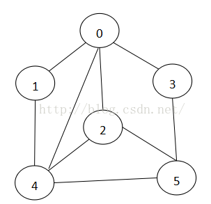
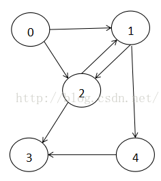
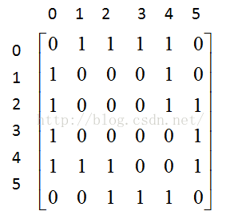
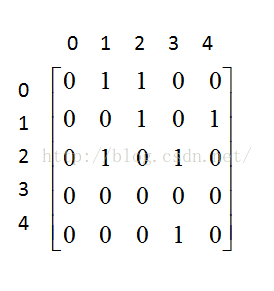
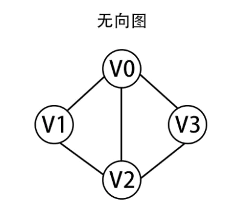
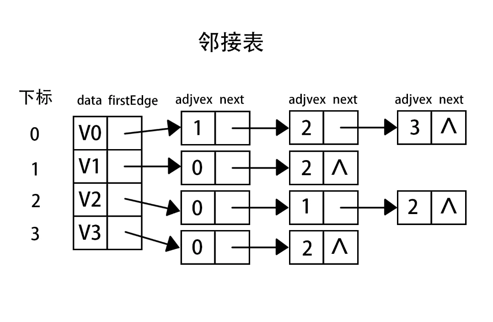

#### 图的抽象数据类型

#### 图的术语
1. 相邻：如果两个顶点通过一条边相连， 则称这两个顶点是相邻的，并称这条边依附于这两个顶点
1. 度数：某个顶点的度数即为依附于它的边的总数。
1. 路径：由边顺序链接的一系列顶点。
1. 简单路径：一条没有重复顶点的路径。
1. 环：一条至少包含一条边且起点和终点相同的路径。
1. 简单环：除了第一个顶点和最后一个顶点之外，其余顶点不重复出现的环。
1. 连通图：任意两个顶点之间互通。一副非连通的图由诺干个连通的部分组成
1. 图的密度：已连接的顶点对占所有可能被连接的顶点对的比例。
1. 平行边：连接同一对顶点的两条边称为平行边。 
1. 二分图：图中的每一条边所连接的两个顶点都分别属于不同的部分，如下图所示：
    

一个图支持如下的操作：
1. 添加点
1. 删除点
1. 添加边
1. 删除边
1. 两个点是否相邻，也就是说连个点之间是否有一条边相连。
1. 邻居：对一个给定的点，返回所有与之相邻的点的集合。
1. 获取点中的值。
1. 设置点中的值。
1. 获取一个边中存放的值。
1. 对一个边设置存放的值。
1. 返回图是否是无方向的。
1. 获取所有的点。
1. 最大的点ID：返回所有点的最大ID。

表示一个图主要有两种方式：邻接矩阵，邻接表。

##### 邻接矩阵
邻接矩阵是表示图中顶点之间相邻关系的举证，对于n个顶点的图而言，矩阵的row和col表示的是1...n个点，对于无向图，如果顶点b1和
b2是连接的，那么在二维矩阵中的(b1,b2)，(b2,b1)位置的值为1，如果是有向图b1指向b2，那么(b1,b2)的值为1，(b2,b1)的值为0。
如下图：        
         

    

在无向图中，从一个点到另一个点是互通的，所以邻接矩阵是对称的。

如果图是一个带权图，需要把1换为相应边上的权值，把非对角线上的换成一个很大的特定的实数则可，表示相应的边不存在，这个特定的实数通常用无穷大
或MaxValue来表示，他要大于图中所有边的权值（这里就不多加以举例）。

##### 邻接表
邻接列表是一种空间更加高效的图表示。用于表示稀疏图，稀疏图是一种对比完整图有极少的边的图。一个完整图含有v(v-1)/2条边，邻接矩阵需要的存储空间为
v2，所以，对于稠密（接近完整）图，可以存储为邻接矩阵，但是稀疏图则不然。邻接列表的表示如下：

邻接列表使用数组和链表相结合的方法存储。数组存储顶点信息，链表存储边信息。

##### 图的遍历
图的遍历和树的遍历类似，有深度遍历和广度遍历。不同的是，图可以不用通过边而遍历到所有的顶点。所以需要从边和顶点两方面分别考虑。另外，图没有特别
制定的根节点。我们可以从任意的顶点开始。

顶点的遍历，我们使用两个顶点的集合：一个集合存储已经发现但尚未被访问的顶点，另一个集合存储顶点是否已被访问的boolean数组。

已经发现但还未被访问的数组有两种类型：如果是stack，我们执行的是深度遍历，如果是queue，那么执行的是广度遍历。

##### 环的检查
图遍历的一个应用就是环的检查，没有环的无向图就是一棵树。没有环的有向图被称为有向无环图。在无向图中，我们做深度遍历时，同样的节点被作为某个边的终点
访问了两次。那么这个节点就形成了一个环。因为是无向图，所以不存在环的情况下，边的终点是不会重复出现的。在有向图中，访问相同节点两次还不能断定该节点
形成了一个环，我们需要记录整个路径根据边的方向来断定。

##### 最小生成树
生成树是由所有顶点和一些边组成的无环连通子图。
拥有最少边，并且去掉任何一个边会导致图不能联通的生成树，我们称它为最小生成树。
最小生成树，拥有如下特性：
1. 用一条边连接树中的任意两个顶点都会产生一个新的环。
1. 从树中任意删除一条边都将会得到两棵独立的树。
1. 如果拥有V个顶点和E条边，那么V=E+1
1. 任意连通的无向图拥有一个生成树。
1. 任意符合V=E+1属性的无向连接图是一个树。
1. 最小生成树在一个图中是唯一的，并且权重和其他的生成树都不一样。

###### 切分定理
切分是对于带权重的无向连接图来讲的。
切分：把一个无向连通图分割为不连接的两部分，需要移除的边的集合。一个图中有很多切分。
切分定理可以理解为：在一个切分中，如果有一个边连接两个部分，并且拥有最小的权重，那么它就是最小生成树的一部分。
对于所有的无向连通图切分，生成树包含有且只有一条一个切分中的边。

##### 最小生成树的查找
通过如下步骤查找一个最小生成树：
1. 初始化一个空的边的集合，作为最小生成树。
1. 如果还有边剩余且还有顶点未连接，选取最小权重的边。
1. 如果选取的边已经连接了两个顶点，丢弃并回到上一步。
1. 否则，将边添加到最小生成树中。
1. 从第二步开始重复。

知道了步骤，我们只要关注如何快速知道两个顶点是否连接这个问题。解决方法是一种数据结构，称为union set forest。

###### union find
并集查找的目的是判断两个对象是否在相同的集合中。参考代码unionfind包

