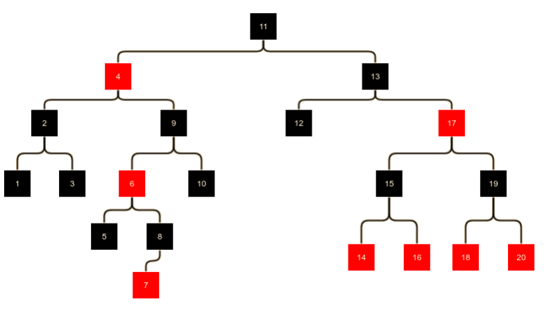
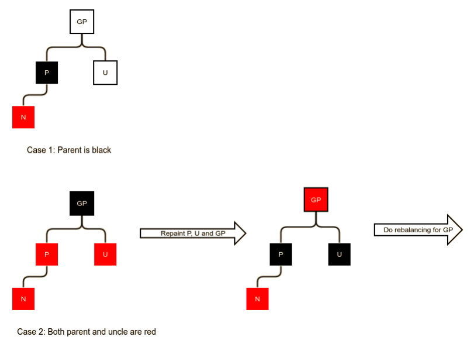
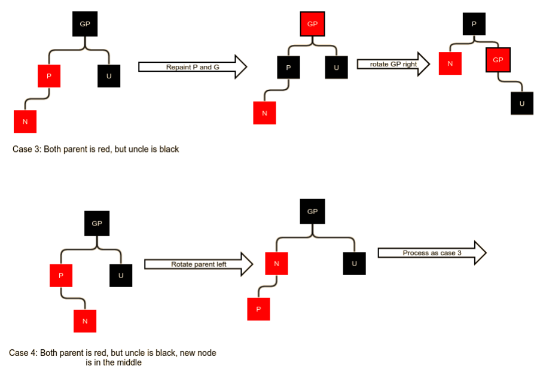
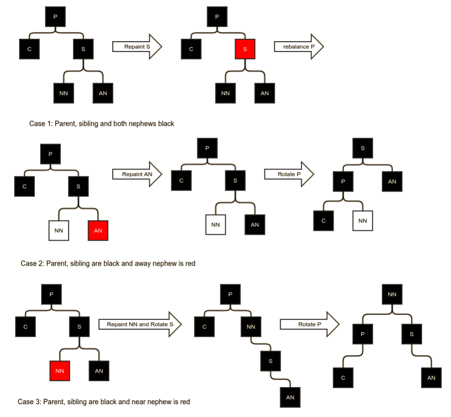
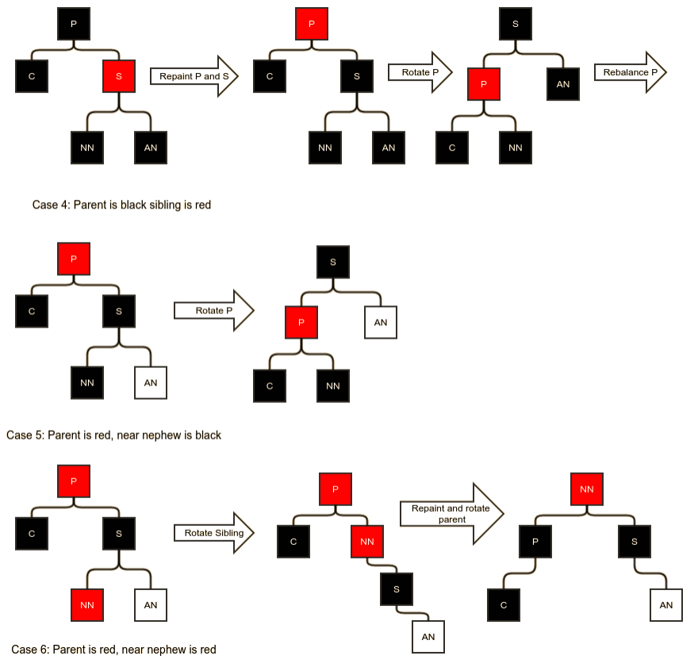

### 红黑树

AVL树保证了对数级的插入，删除和搜索，但是在数据随机插入和删除的情况下，产生了大量的旋转，甚至一些不必要的反向旋转。

在红黑树种，节点拥有颜色，红色或者黑色。在操作节点的时候，颜色可以切换。但是它们时钟遵循如下的条件：
1. 根节点是黑色。
2. 红色节点的子节点必须是黑色。
3. 从一个节点到该节点的叶节点的所有路径行的黑色节点数相同。
4. 所有叶节点被设置为Null,并且被认为是黑色，他们作为红黑树的仅有的叶节点。

红黑树通过保证黑节点的平衡，牺牲了一定的严格平衡，节省了大量的旋转操作。

为了便于说明，我们在后面的例子和代码中将空叶节点去掉，空叶节点只为了便于计算树的高度。例如：
     
树的黑节点高度为4。

#### 插入后的平衡调整
相较BST,红黑树的插入和删除更加复杂。 红黑树的插入和BST中的插入一样，在插入完成后，将插入的节点标为红色。这样保证了黑节点的高度不变。但是可能导致
一个节点的父节点为红色，违反了第二条规则。 我们需要做一些操作来修复这种情况。 共分为4种情况。
1. 父节点为黑色，在这种情况下，直接添加节点，不需要其他操作。
1. 插入节点的父节点和叔节点都是红色，这种情况下，我们需要重新绘制父节点，叔节点，祖父节点，让黑节点的高度保持不变。如果祖父节点是根节点，保持根节点
的颜色为黑色不变，在这种情况下，整个树的黑节点高度会加1。如果祖父节点不是根节点，那么在祖父改变为红色后，树可能失去平衡，所以需要重新对祖父节点进行
平衡操作。
       
1. 父节点是红色，且叔节点为黑色。且插入节点与父节点的左右方向和父节点与祖父节点的左右方向一致。这种情况下，我们对父节点和祖父节点互换颜色，并对祖父
节点做和插入节点左右方向相反的旋转。
1. 和第三种情况类似，但是插入节点与父节点的左右方向和父节点与祖父节点的左右方向相反。这种情况下，我们对父节点做一次和插入节点左右方向相反的旋转，
这样会转变成第三种情况，下面的步骤就可以按照第三种情况来处理。
      

#### 删除后的平衡调整。
红黑树种删除一个节点和在BST中删除一个节点一样，删除后为了让树达到再次平衡，还需要执行调整操作。当删除一个红色节点时，我们不需要进行调整；当我们删除
的是黑色节点，且子节点为红色，我们只需要将子节点绘制为黑色即可；下面我们讨论删除黑色节点且子节点（包括了null）为黑色的情况。调整依赖于父节点，兄弟
节点和兄弟节点的子节点（即子侄节点）的颜色情况。我们规定删除的节点位置为当前节点。

1. 父节点，兄弟节点，子侄节点都为黑色。这种情况下，我们只需要简单地将兄弟节点修改为红色，让父节点子树平衡，但是父节点子树的黑节点高度减少了1，整个
树是不平衡的，接下来的步骤需要再调整父节点子树在整个树中的平衡。
1. 父节点和兄弟节点为黑，但是远的子侄节点为红色。这种情况下，我们需要将远的子侄节点设置为黑色，然后将父节点朝着当前节点的方向旋转。
1. 父节点和兄弟节点为黑，但是近的子侄节点为红色。这种情况下，我们先将近子侄节点设置为红色，先对兄弟节点向当前节点的反方向旋转，然后再将父节点向当前
节点的方向旋转。即双旋转。       

1. 父节点和子侄节点为黑，兄弟节点为红色。这种情况下，我们先将父节点和兄弟节点的颜色互换，然后将父节点朝着当前节点旋转。这样做之后，任何节点的黑节点
高度都没有改变，所以没达到我们的效果，我们需要再次对红色节点进行平衡调整。情况会转换为下面的两种情况。
1. 父节点为红色，近的子侄节点为黑色。只需要将父节点向当前节点的方向旋转即可。
1. 父节点为红色，近的子侄节点为红色，需要做双先转，首先将兄弟节点向当前节点相反的方向旋转，然后将父节点向当前节点的方向做旋转。       

 
#### 红黑树最坏的情况
所谓最坏的情况就是高度为h的树拥有最少的节点数。
由于红黑树的规则，红色节点的子节点必须为黑色节点，所以一个高度为h的树，黑节点的高度最大为h/2=l。则黑节点高度为l的最少节点数
`f(l)=2(l+1)-2`      
f(l)=2(l+1)-2

