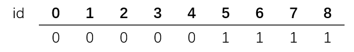
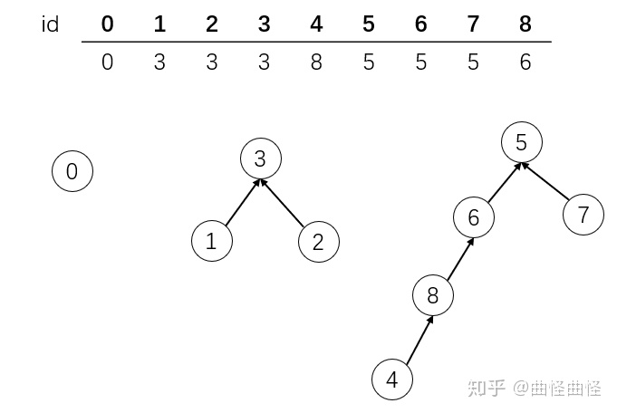
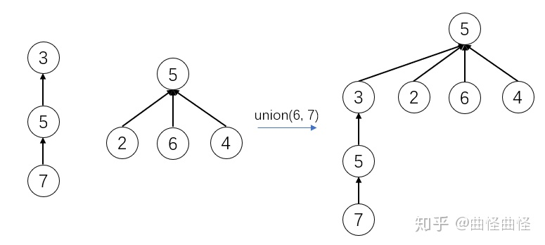
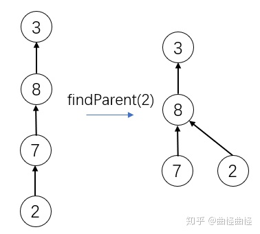

### 并查集（union find）

#### 什么是并查集
并查集主要处理的问题是连接问题。主要回答的是一个网络当中两个节点是否连接的问题。对于一组数据主要支持两个动作。
* union(p,q) //连接两个元素
* isConnected(p,q) //查看是否连接

参考接口UF。

#### 并查集实现一
我们在实现的时候采用数组的形式进行实现。

从图中我们看出来，id代表我们要查询的索引，下面的值代表了类别。0-4为一个连通的集合，5-8为另一个连通的集合。代码实现如下：
1. 判断是否连接       
判断两个节点是否连接，直接判断节点索引对应的值是否相同。
```java
private int find(int p) {
    if (p < 0 || p >= id.length)
        throw new IllegalArgumentException("p is out of bound");
    return id[p];
}

@Override
public boolean isConnect(int p, int q) {
    return find(p) == find(q);
}
```
1. 连接两个节点       
连接两个节点是让两个节点的值相等。
```java
@Override
public void union(int p, int q) {
    if (isConnect(p, q))  // 先判断是否连接
        return;
    for (int i = 0; i < id.length; i++)  //遍历整个数组继续两个节点的所以伴随节点全部相同
        if (id[i] == id[q])
            id[i] = id[p];
}
```

#### 并查集实现二
版本一的不足之处就在于连接两个元素的时间复杂度为O(N)级别，需要遍历整个数组。        
我们这里优化的方式就是采用树结构。我们这里的树结构同以往不一样。向二分搜索树的树结构都是父节点指向子节点。但是在并查集里面我们需要设立一个子节点
指向父节点的树结构。
一个树即为一类，我们再进行连接的时候，只需要将他们的父节点连接在一起就可以了。 我们这里依然采用数组进行实现。 
        
在这里我们规定如果id和值相同，那么该节点为根节点。这样我们很容易判断出根节点。
实现代码参考UnionFind2

##### 基于rank进行优化
再进行两个节点的连接后，由于需要连接根节点，导致树的高度可能会增加，这会让树的效率降低。如下：
        
如上，节点3去指向节点5，反而导致树结构高度为4。如果我们让高度低的去指向高度高的，那么树的高度将不会增加。具体可以参照下图：
       
如果两个高度相同的进行连接，那么高度只会增加一。
参考代码UnionFind3

##### 路径压缩
其实，并查集的这种数据结构，对于树的结构本身是什么样子的，我们并不关心，只要是同一个树，那么它的他们的全部节点就是一类。所以我们可以任意修改树的结构，
修改的方式就是在查询操作的时候对树在高度上进行压缩。
      
其代码如下，只需要增加一行压缩代码即可：
```java
private int findParent(int id) {
    if (id < 0 || id >= parent.length)
        throw new IllegalArgumentException("id is out of bound");
    while (parent[id] != id) {
        parent[id] = parent[parent[id]];  //增加一行代码
        id = parent[id];
    }
    return id;
}
```

参考自知乎：https://zhuanlan.zhihu.com/p/109986090。