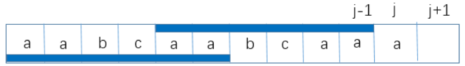
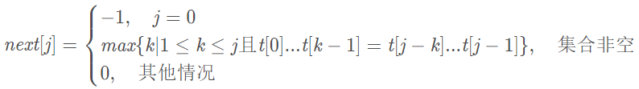

### KMP算法

在一个字符串中查找子串时，常规操作是，母串和子串双循环，发生不匹配的字符时，母串回退到开始比对的位置，后移一位继续比对。
那么，有没有更好的方法呢。那就是KMP算法。在比对不匹配时，母串位置不回退，子串只需要再向前移动到特殊的位置继续比对即可。
匹配效率大大增加。

子串的移动是有一定规律可循的，并且只依赖于其自身，和匹配的母串没有关系。
假设我们有如下子串abcabdf，正在匹配一个母串。
当匹配到母串的第六个字符e时，不匹配了。
```
...abcabe...
   abcabdf
```
那么我们下次匹配的子串位置应该如下：
```
...abcabe...
      abcabdf
```
这时，我们可以看到子串第六个位置d之前，存在着某些规律，头部的ab,和d之前的ab相等。这里的ab可以表述为子串的前缀和后缀。
一个子串的前缀是除了最后一个字符的所有顺序前部组合，如abcd的前缀为:a,ab,abc。后缀和前缀相反，为d,cd,bcd。
即KMP算法，只有在前缀和后缀有相同时，才会有部分移动的需要。一个前后缀的例子如下：      


由此，对每个字符串的每个位置，在匹配失败的时候，我们可以计算出需要前移到子串的某个位置可以继续进行匹配。这样的一个数组
我们称它为next数组。
那么对于abcabdf字符串next数组的计算方式如下：
1. 首位不匹配，表示母串需要移动，定义为固定的-1.
2. 第二位不匹配，由于前面只有一个字符，没有前后缀。所以为0.
3. 此后的每一位是前面字符串中前缀和后缀相等的最大数字。所以第三位第四位依然为0.
4. 第5为为b,前面的字符串为abca,前后缀最大相等的是a,为1。
1. 以此类推，第六位为2，第七位为0。
        
最终得出next数组为`[-1,0,0,0,1,2,0]`。

数学公式如下：     
      

